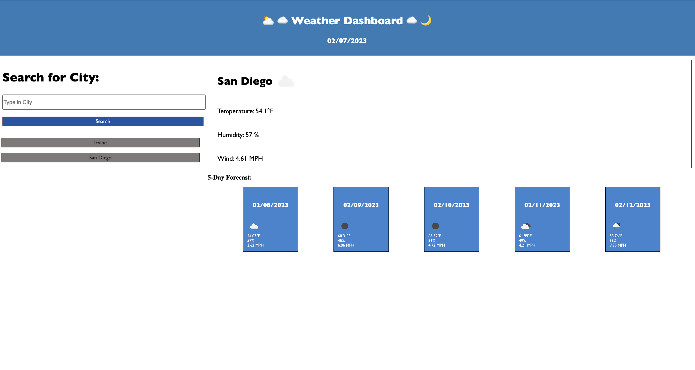

# weather_api

#### Daniel Hernandez
 

## Technologies Used
<ul>
    <li>HTML</li>
    <li>CSS</li>
    <li>Javascript</derli>
</ul>    

 

## Description
This application is used to present the current weather for any city, as well as displaying a5 day forecast which includes the temperature, humidity, and windspeed. A corresponding icon will inform the user of the weather conditions.

 

## Installation
 

https://danalexanderh.github.io/weather_api/

 

## Usage
Users would be asked to type in a city of their choosing. When clicking on the seach button, the user will see a container that shows the current weather, temperature, humidity, and windspeed with an icon to easily show what the current condition is like in the city. What also appears is a 5 day forecast that dynamically appears underneath the current weather container. In the 5 day forecast container, the user will be presented with 5 individual boxes which hold the same information included in the current container but for the following days.
   

